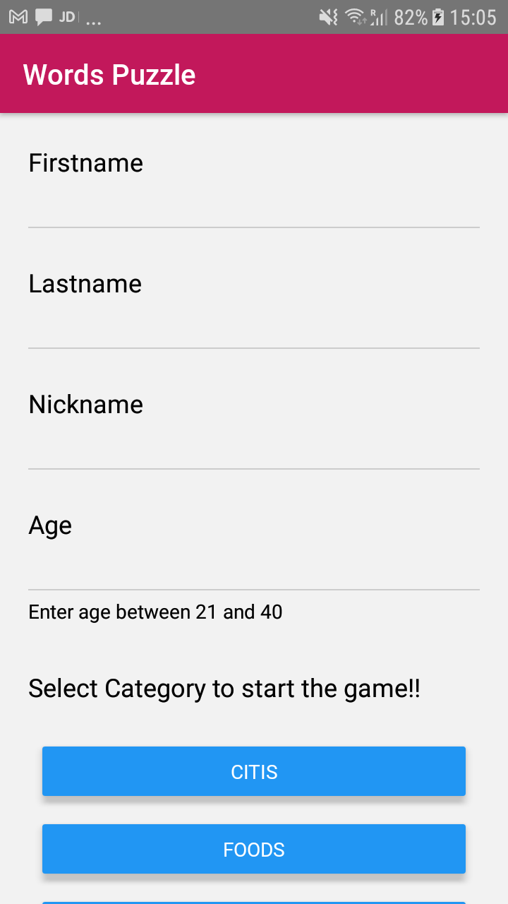
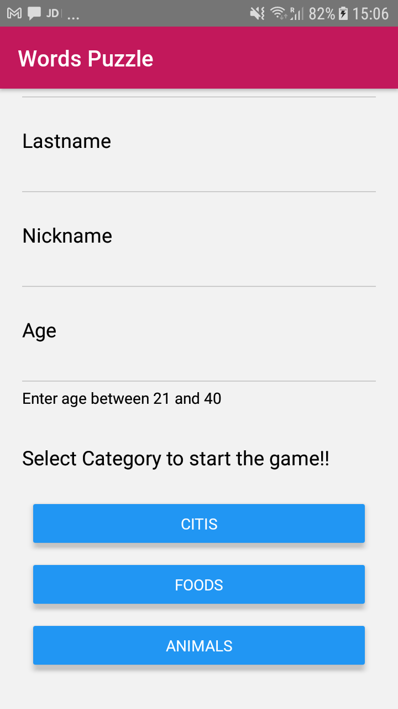
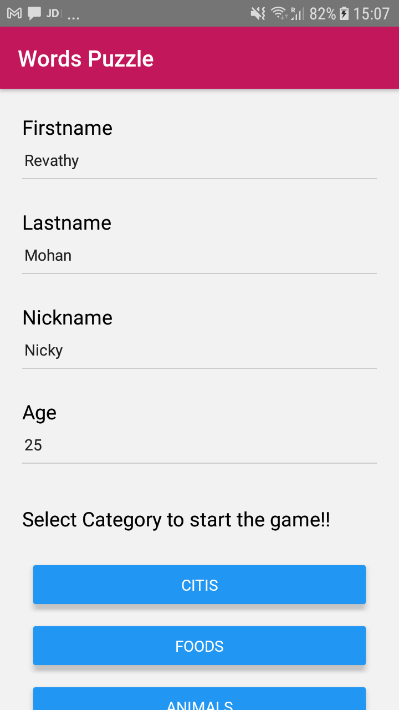
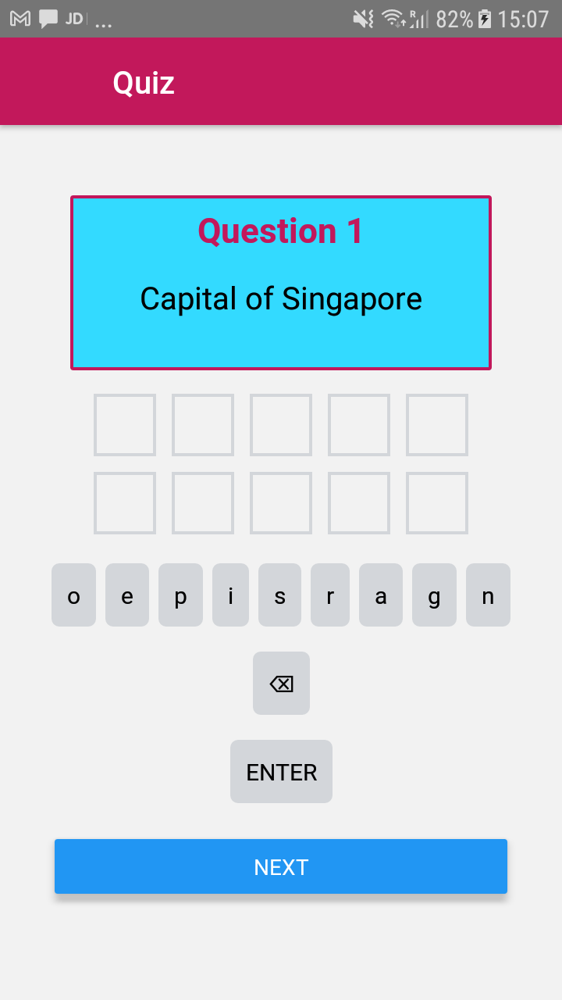
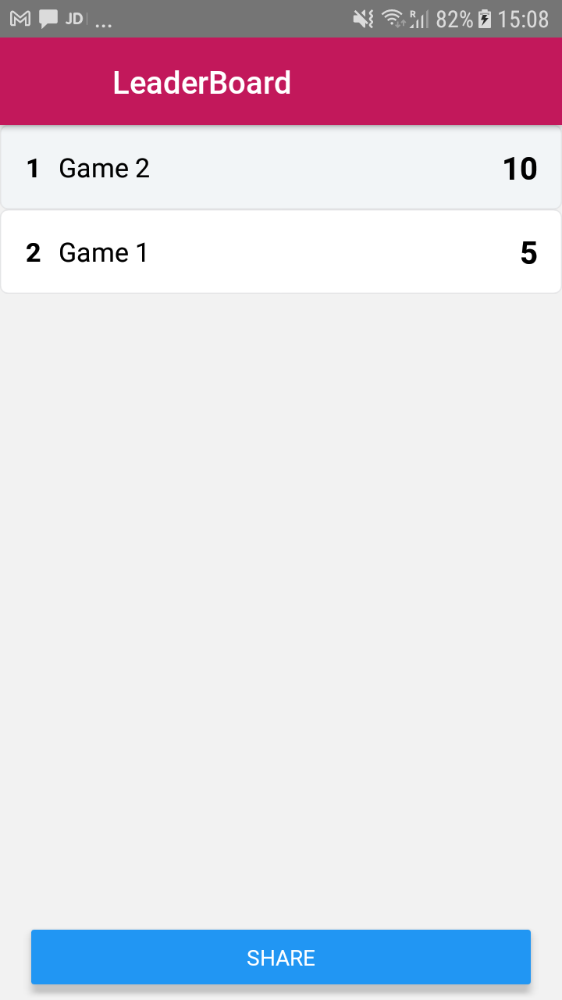
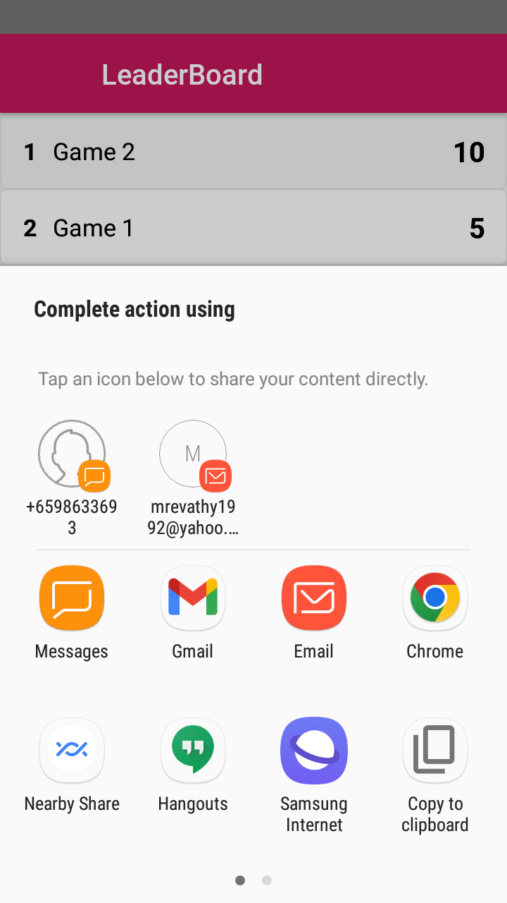

# Word Puzzle (React-Native)

<table>
<tr>
<td>
<strong>Standard word Puzzle Quiz Application developed with React Native</strong>
</td>
</tr>
</table>

## Features
* Saves user information with Shared preferences and shows that on app restart
* Can play the quiz and the score will be updated
* Leaderboard helps in viewing the scores of all the players 
* User friendly design
* Download and install .apk file here in word_puzzle.apk

## Requirements

- React Native
- Either VS Code or Android Studio

## Setup 

- Install React Native
- clone the repo 
- Start terminal and write command  <code>react-native run-android </code>and run app on your plugged phone/Android Emulator
- Start terminal and write command  <code>react-native run-ios </code>

## Screenshots

<table>
  <tr>
    <td>User Info Form</td>
    <td>User Info with select category</td>
    <td>Filled data of userInfo</td>
  </tr>
  <tr>
    <td valign="top"></td>
    <td valing="top"></td>
    <td valing="top"></td>
  </tr>
  <tr>
    <td>Quiz screen</td>
  </tr>
  <tr>
    <td valign="top"></td>
  </tr>
  <tr>
    <td>Leaderboard Screen</td>
    <td>Leaderboard with share tray</td>
  </tr>
  <tr>
    <td valign="top"></td>
    <td valign="top"></td>
  </tr>
 </table>

  
 

